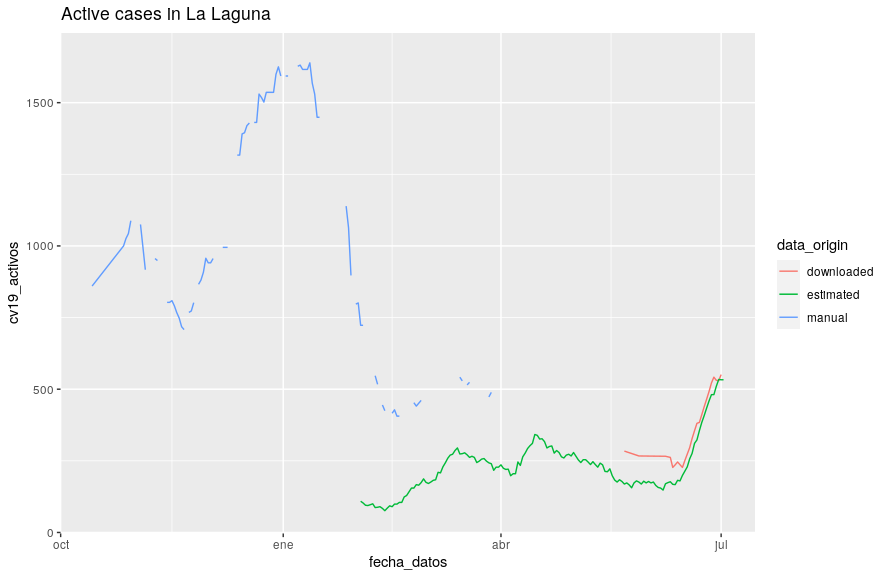

# Readme
This project consist on a [Shiny app](https://jueves.shinyapps.io/covid_canarias/) that aims to compare the evolution of the SARS-CoV-2 epidemic between diferent locations in Canary Islands.

Data up to 23/05/2021 has been manually collected from [Grafcan dashboard](https://grafcan1.maps.arcgis.com/apps/opsdashboard/index.html#/156eddd4d6fa4ff1987468d1fd70efb6). Only two locations have been manually collected and many daily measures are missing.

Data after 23/05/2021 is automatically downloaded from [Canarias Datos Abiertos](https://datos.canarias.es/catalogos/general/dataset/datos-epidemiologicos-covid-19).

## Collected daily active cases
Daily active cases in the original dataset from Canarias Datos Abiertos doesn't save a history, just the present day value, so [a parallel project](https://github.com/jueves/covid_canarias_data) has been developed to download and store these daily measurements.

## Estimated daily active cases
A history of old daily active cases aggregated per municipality has been estimated from [individual cases](https://datos.canarias.es/catalogos/general/dataset/datos-epidemiologicos-covid-19/resource/3b5b2d84-fe9d-42eb-91eb-54f0cb3cb4cc) in order to get full data, at least from February 2021 onwards.

This data has a mismatch with values from the daily active cases dataset for data before june 2021.

We can see the mismatch between the three datasets, which refer to the same event but differ in the source. In this case we focus on "La Laguna" location.  

On blue there is data manually collected from the Grafcan dashboard. On red data automatically downloaded from Canarias Datos Abiertos. The green line is the same measure, but in this case the aggregated municipality values are not directly obtained, but calculated from the non-aggregated cases dataset from Canarias Datos Abiertos.

This topic is covered in more depth in [this document](https://github.com/jueves/covid_compara/blob/main/mismatch.md).
