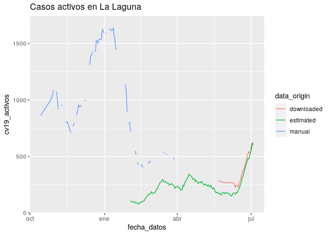
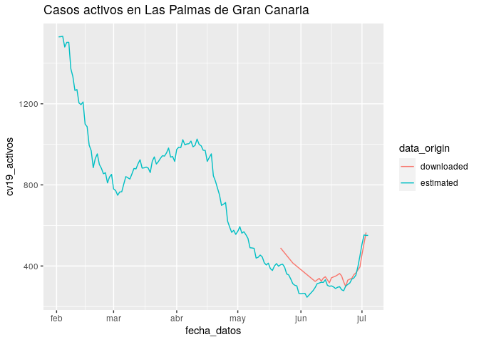
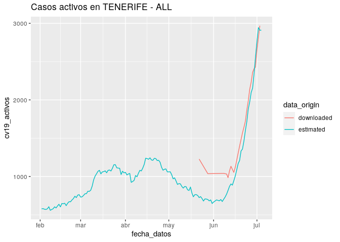
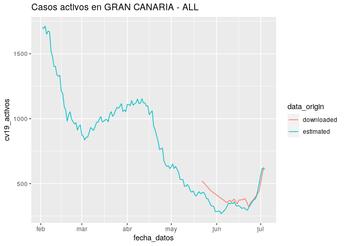
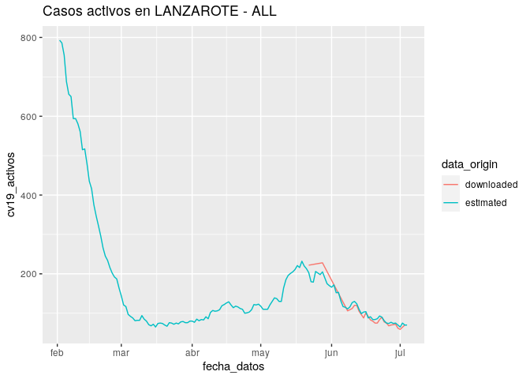
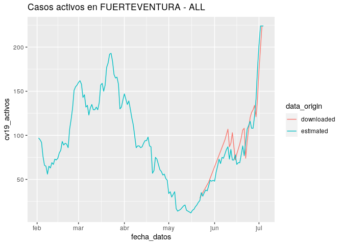

Discrepancia entre casos activos estimados y publicados
================

Se han obtenido los casos activos de COVID-19 por día y municipio a
partir de datos desagregados publicados por [Canarias Datos
Abiertos](https://datos.canarias.es/catalogos/general/dataset/datos-epidemiologicos-covid-19).
Sin embargo para algunos municipios estos no coinciden con los datos
agregados proporcionados por la misma fuente.

A continuación se desarrolla el procesado de los datos para obtener los
datos agregados a partir de los desagregados y se muestra la comparación
entre ambos conjuntos en distintos gráficos.

## Carga de datos

``` r
library(tidyverse)
library(lubridate)

data_grouped <- read.csv("https://github.com/jueves/covid_canarias_data/raw/main/data/cv19_asignacion_agrupados_collected.csv")
data_grouped$fecha_datos <- dmy(data_grouped$fecha_datos)

data_manual <- read.csv("data/cv19_asignacion_agrupados_manual.csv")
data_manual$fecha_datos <- dmy(data_manual$fecha_datos)

data_ungrouped <- read.csv("https://opendata.sitcan.es/upload/sanidad/cv19_municipio-asignacion_casos.csv")
data_ungrouped$fecha_datos <- dmy(data_ungrouped$fecha_datos)
```

## Estimación de casos activos agregados por municipio y fecha

El conjunto de datos desagregados consiste en una fila por paciente que
incluye entre otros atributos municipio al que ha sido asignado el caso,
fecha de detección del caso, fecha de recuperación y fecha de
fallecimiento.

Ya que estos datos desagregados solo están disponibles a partir del
1/1/2021, no se incluyen los casos iniciados antes de esta fecha aunque
algunos continuen activos al terminar el año 2020. A fin de solventar
este problema, y dado que la COVID-19 se resuelve casi siempre en un
plazo inferior a un mes, de los datos agregados generados se excluye el
mes de enero.

``` r
# Create dataframe with metadata
data_grouped %>%
  group_by(municipio, isla) %>%
  summarise(municipio, poblacion=mean(poblacion), isla) %>%
  distinct() %>%
  mutate(municipio=as.character(municipio),
         isla=as.character(isla))-> municipios_metadata

# Set as date
data_ungrouped$fecha_datos <- dmy(data_ungrouped$fecha_datos)
data_ungrouped$fecha_caso <- dmy(data_ungrouped$fecha_caso)
data_ungrouped$fecha_fallecido <- dmy(data_ungrouped$fecha_fallecido)
data_ungrouped$fecha_curado <- dmy(data_ungrouped$fecha_curado)

# Create a single end date for each case
end_date <- c()
for (i in 1:nrow(data_ungrouped)){
  posible_dates <- as.Date(c(data_ungrouped$fecha_fallecido[i], data_ungrouped$fecha_curado[i], today()+1),
                           origin="1970-01-01")
  end_date <- append(end_date, min(posible_dates, na.rm=TRUE))
}

data_ungrouped['fecha_final'] <- end_date

# Create date-municipio-active_cases_counter dataframe
municipio_list <- c()
fecha_list <- c()
for (i in 1:nrow(data_ungrouped)){
  num_days <- as.numeric(data_ungrouped$fecha_final[i] - data_ungrouped$fecha_caso[i])
  if (num_days < 0){
    num_days <- 0
  }
  case_dates <- seq(data_ungrouped$fecha_caso[i], by = "day", length.out = num_days)
  case_municipio <- rep(as.character(data_ungrouped$municipio[i]), num_days)
  
  municipio_list <- append(municipio_list, case_municipio)
  fecha_list <- append(fecha_list, case_dates)
}
data.frame(fecha=fecha_list, municipio=municipio_list) %>%
  group_by(fecha, municipio) %>%
  count() -> data_estimated

# Add isla and poblacion for each estimation
isla_list <- c()
poblacion_list <- c()
for (i in 1:nrow(data_estimated)){
  selection_vector <- municipios_metadata$municipio == data_estimated$municipio[i]
  if (as.character(data_estimated$municipio[i]) == "SIN ESPECIFICAR"){
    selected_isla <- NA
    selected_poblacion <- NA
  } else {
    selected_isla <- municipios_metadata$isla[selection_vector]
    selected_poblacion <- municipios_metadata$poblacion[selection_vector]
  }
  isla_list <- append(isla_list, selected_isla)
  poblacion_list <- append(poblacion_list,selected_poblacion)
}
data_estimated['isla'] <- isla_list
data_estimated['poblacion'] <- poblacion_list

# Add missing columns
data_estimated %>%
  mutate(cv19_total_casos=NA, cv19_fallecidos=NA, cv19_curados=NA) %>%
  rename(cv19_activos=n, fecha_datos=fecha) %>%
  filter(fecha_datos>dmy("1/2/2021")) -> data_estimated
```

## Fusión de los datos

Contamos con tres fuentes para los mismos datos.

Por un lado tenemos un conjunto de datos **recolectados de forma
manual** desde [el dashboard de
Grafcan](https://grafcan1.maps.arcgis.com/apps/opsdashboard/index.html#/156eddd4d6fa4ff1987468d1fd70efb6).
Estos datos incluyen únicamente el municipio de La Laguna y la isla de
La Palma (casos activos totales de la isla) entre octubre de 2020 y
abril de 2021.

Contamos también con datos **agregados descargados** directamente desde
Canarias Datos Abiertos para todos los municipios desde el 22 de mayo de
2021 en adelante, si bien durante las primeras semanas no contamos con
observaciones para todos los días.

El tercer conjunto de datos a fusionar será el de los casos activos
**agregados que hemos estimado a partir de los valores desagregados**.

``` r
data_all <- bind_rows(list(downloaded=data_grouped, estimated=data_estimated,
                           manual=data_manual), .id="data_origin")
```

## Comprobación de duplicados

Comprobamos ahora que no existen datos duplicados para cada combinación
de fecha, municipio y origen de los datos.

``` r
# Check for duplicated data
data_all %>%
  group_by(fecha_datos, municipio, data_origin) %>%
  count() %>%
  filter(n>1)
```

    ## # A tibble: 0 x 4
    ## # Groups:   fecha_datos, municipio, data_origin [0]
    ## # … with 4 variables: fecha_datos <date>, municipio <fct>, data_origin <chr>,
    ## #   n <int>

## Agregación de datos insulares

A continuación se generan datos agregados a nivel de isla.

``` r
data_all %>%
        filter(!str_detect(municipio, "- ALL")) %>%
        filter(data_origin!="manual") %>%
        group_by(fecha_datos, isla, data_origin) %>%
        summarise(fecha_datos, isla, data_origin,
                  poblacion=sum(poblacion),
                  cv19_activos=sum(cv19_activos, na.rm=TRUE),
                  cv19_total_casos=sum(cv19_total_casos, na.rm=TRUE),
                  cv19_fallecidos=sum(cv19_fallecidos, na.rm=TRUE),
                  cv19_curados=sum(cv19_curados, na.rm=TRUE),
                  municipio = paste(isla, "- ALL")) -> data_isla_ALL
    
data_all <- bind_rows(data_all, data_isla_ALL)
    
data_all$isla <- factor(data_all$isla)
data_all$municipio <- factor(data_all$municipio)
```

## Generación de gráficos comparativos

A continuación podemos comparar los datos de las distintas fuentes para
diferentes territorios. Podemos ver grandes diferencias para muchos de
ellos, sin embargo todos parecen converger a partir de mediados de junio
de 2021.

``` r
plot_municipio <- function(municipio_name){
  data_all %>%
  filter(as.character(municipio)==municipio_name) %>%
  ggplot(aes(fecha_datos, cv19_activos, color=data_origin))+geom_line()+
        labs(title=paste("Casos activos en", municipio_name))
}
```

    ## Warning: Removed 5 row(s) containing missing values (geom_path).

<!-- --><!-- --><!-- -->

    ## Warning: Removed 4 row(s) containing missing values (geom_path).

<!-- --><!-- --><!-- --><!-- --><!-- --><!-- --><!-- -->

## Conclusiones

Dado que no todos los territorios presentan incongruencia entre las
fuentes de datos y que a partir de mediados de junio todos ellos
convergen, parece razonable descartar un error en nuestro cálculo de
valores agregados.

Queda sin embargo sin aclarar el origen de esta diferencia entre las
distintas fuentes.

## Trabajo futuro

Podría ser interesante calcular la diferencia entre las distintas
fuentes de datos de forma cuantitativa, por ejemplo a través de la suma
de errores cuadrados.
